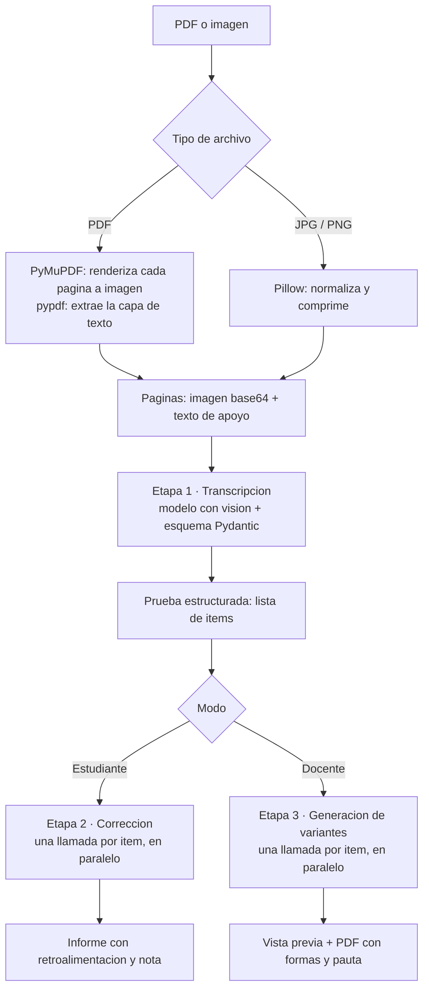

# 🪵 Te educo a palos

Agente de inteligencia artificial que lee una evaluación escolar —en PDF o como
fotografía— separa sus preguntas y trabaja sobre ellas de dos maneras distintas
según quién la sube.

Proyecto desarrollado para el **Challenge Alura Agente**.

**Aplicación en línea:** _(pendiente de desplegar)_

---

## El problema

En un colegio, dos tareas consumen una cantidad desproporcionada de tiempo:

1. **Corregir.** Un docente con cuatro cursos revisa más de 120 pruebas por
   unidad. La retroalimentación real —explicarle a cada estudiante *dónde* se
   equivocó— es lo primero que se sacrifica por falta de horas. El estudiante
   recibe una nota y una cruz roja, que no le enseñan nada.

2. **Crear evaluaciones distintas.** Para que estudiantes sentados juntos no se
   copien, se necesitan varias formas de la misma prueba. Redactarlas a mano
   toma horas y es fácil que las versiones terminen midiendo cosas distintas o
   con dificultad desbalanceada.

Ambas tareas parten del mismo insumo: un documento con preguntas. Este agente
lo lee una vez y resuelve las dos.

## Qué hace

### Modo estudiante

Sube su prueba ya respondida, incluso como foto del cuaderno. El agente:

- Transcribe cada ítem y la respuesta manuscrita, conservando los errores.
- Resuelve el ejercicio por su cuenta, sin mirar lo que respondió.
- Compara ambos resultados y señala **el paso exacto** donde se quebró el
  razonamiento.
- Clasifica el tipo de error: de cálculo, de concepto, de signo, de
  procedimiento.
- Entrega el desarrollo correcto paso a paso y una nota estimada en escala
  chilena de 1,0 a 7,0 con 60% de exigencia.

### Modo docente

Sube una prueba, en blanco o resuelta. El agente:

- Identifica qué habilidad evalúa cada ítem.
- Genera N ejercicios nuevos equivalentes por ítem, con otros números, otros
  nombres y otro contexto, manteniendo la dificultad.
- Arma varias **formas** completas de la evaluación (Forma A, B, C…), una por
  fila de la sala.
- Exporta todo a un **PDF listo para imprimir**, con la pauta de corrección
  resuelta paso a paso al final.

---

## Arquitectura



### Decisiones de diseño

**Se envía siempre la imagen, no solo el texto.**
Una prueba resuelta mezcla enunciado impreso con desarrollo manuscrito. La capa
de texto del PDF contiene lo primero pero nunca lo segundo. Por eso cada página
se renderiza como imagen y el texto extraído se adjunta solo como apoyo, para
precisar enunciados largos o símbolos ambiguos.

**No se usa OCR tradicional.**
Tesseract y similares destruyen la notación matemática: pierden fracciones,
exponentes y radicales, y fallan casi por completo con escritura a mano. Un
modelo con visión interpreta la imagen entendiendo el contexto matemático, y
además no obliga a instalar binarios del sistema, lo que simplifica el
despliegue.

**El modelo resuelve antes de corregir.**
Si se le pide "revisa si esta respuesta está bien", el modelo tiende a validar
el desarrollo que ya está escrito. Para evitarlo, el esquema `Correccion`
declara `resolucion_propia` y `respuesta_correcta` **antes** que `es_correcta`.
Como la salida estructurada se genera campo por campo en orden, el modelo se ve
obligado a resolver el ejercicio desde cero antes de poder emitir un juicio
sobre la respuesta del estudiante.

**Un ítem por llamada, en paralelo.**
Mandar la prueba completa en un solo prompt hace que el modelo arrastre el
contexto de una pregunta a la siguiente y produzca correcciones inconsistentes.
Aislar cada ejercicio elimina ese efecto, y ejecutar las llamadas en un
`ThreadPoolExecutor` evita que el tiempo de respuesta crezca linealmente con la
cantidad de preguntas.

**Salida estructurada en vez de texto libre.**
Todas las respuestas del modelo se validan contra esquemas Pydantic mediante
`with_structured_output`. Esto elimina el parseo frágil de texto y hace que un
error del modelo falle de forma explícita en lugar de propagarse silenciosamente
a la interfaz.

---

## Tecnologías

| Componente | Herramienta |
|---|---|
| Lenguaje | Python 3.12 |
| Agente y orquestación | LangChain |
| Modelo de lenguaje | Google Gemini o OpenAI GPT (intercambiables) |
| Lectura de PDF | PyMuPDF (renderizado) y pypdf |
| Procesamiento de imágenes | Pillow |
| Validación de salida | Pydantic |
| Interfaz web | Gradio |
| Generación de PDF | ReportLab |
| Despliegue | Hugging Face Spaces |

El proyecto funciona con **dos proveedores de modelos** sin cambios en el
código. Si existe `GOOGLE_API_KEY` usa Gemini; si existe `OPENAI_API_KEY` usa
GPT. La variable `PROVEEDOR` permite forzar uno de los dos.

---

## Ejemplos

La carpeta [`ejemplos/`](ejemplos/) incluye dos pruebas de matemática de 1°
medio para probar la aplicación sin necesidad de tener un documento propio.

### Modo estudiante

Archivo: `ejemplos/prueba_matematica_resuelta.pdf`, que contiene una prueba con
aciertos y con errores frecuentes deliberados.

> **Ítem 4:** Un triángulo tiene una base de 12 cm y una altura de 7 cm.
> Calcula su área.
> **Respuesta del estudiante:** 84 cm²

Respuesta del agente:

> ❌ **Ítem 4 · Error de procedimiento** — 0,5 / 2 puntos
>
> **Tu respuesta:** 84 cm² · **Respuesta correcta:** 42 cm²
>
> **Dónde se quebró:** en el primer paso escribiste $A = base \cdot altura$,
> que es la fórmula del área del rectángulo, no la del triángulo.
>
> Multiplicaste bien 12 por 7, así que el cálculo aritmético está correcto. Lo
> que falta es dividir por 2, porque un triángulo ocupa exactamente la mitad
> del rectángulo que lo contiene.
>
> **Paso a paso:**
> 1. Identificar la fórmula: $A = \frac{b \cdot h}{2}$
> 2. Reemplazar: $A = \frac{12 \cdot 7}{2}$
> 3. Calcular el numerador: $A = \frac{84}{2}$
> 4. Dividir: $A = 42$ cm²
>
> 💡 *Cuando uses una fórmula de área, dibuja la figura y pregúntate si cabe
> entera en un rectángulo o solo la mitad.*

Otras preguntas que resuelve sobre el mismo archivo:

| Ítem | Error del estudiante | Lo que detecta el agente |
|---|---|---|
| 2 | Responde 12 a "¿cuánto es $3^4$?" | Confundió potencia con multiplicación: calculó $3 \cdot 4$ en vez de $3 \cdot 3 \cdot 3 \cdot 3 = 81$ |
| 5 | Responde 4/10 a $\frac{3}{4} + \frac{1}{6}$ | Sumó numeradores y denominadores por separado, sin buscar denominador común |
| 7 | Responde 14 cm a la hipotenusa de catetos 6 y 8 | Sumó los catetos en lugar de aplicar Pitágoras: $\sqrt{6^2 + 8^2} = 10$ |
| 1, 3, 6, 8 | Correctos | Los valida y entrega el desarrollo completo igualmente |

### Modo docente

Archivo: `ejemplos/prueba_matematica_en_blanco.pdf`.

A partir del ítem "Resuelve la ecuación $2x + 5 = 17$", el agente identifica el
concepto —*resolución de ecuaciones lineales de primer grado*— y genera:

| Forma | Ejercicio generado | Respuesta |
|---|---|---|
| A | Resuelve la ecuación $4x - 7 = 21$ | $x = 7$ |
| B | Resuelve la ecuación $3x + 8 = 29$ | $x = 7$ |
| C | Resuelve la ecuación $6x - 5 = 31$ | $x = 6$ |

El PDF descargable contiene las tres formas completas, cada una con su
encabezado y espacio de desarrollo, más la pauta de corrección resuelta paso a
paso al final del documento.

---

## Cómo ejecutarlo

### Requisitos

- Python 3.10 o superior.
- Una clave de API. La forma más rápida y sin costo es
  [Google AI Studio](https://aistudio.google.com/apikey), que no pide tarjeta de
  crédito.

### Instalación

```bash
git clone https://github.com/3betclover/DesafioAlura.git
cd DesafioAlura

python -m venv .venv
source .venv/bin/activate        # En Windows: .venv\Scripts\activate

pip install -r requirements.txt
```

### Configuración

```bash
cp .env.example .env
```

Edita `.env` y completa una de las dos claves:

```ini
GOOGLE_API_KEY=tu_clave_de_google
# o bien
OPENAI_API_KEY=tu_clave_de_openai
```

### Ejecución

```bash
python app.py
```

La aplicación queda disponible en `http://127.0.0.1:7860`.

### Regenerar las pruebas de ejemplo

```bash
python scripts/generar_prueba_ejemplo.py
```

---

## Estructura del proyecto

```
.
├── app.py                          Interfaz Gradio y punto de entrada
├── src/
│   ├── config.py                   Variables de entorno y elección de proveedor
│   ├── modelos.py                  Esquemas Pydantic de la salida del modelo
│   ├── extraccion.py               PDF e imágenes a páginas procesables
│   ├── agente.py                   Transcripción, corrección y variantes
│   ├── exportar.py                 Generación del PDF con las formas y la pauta
│   └── presentacion.py             Resultados a Markdown y cálculo de nota
├── scripts/
│   └── generar_prueba_ejemplo.py   Crea las pruebas de demostración
├── ejemplos/                       Pruebas en PDF para probar la aplicación
├── requirements.txt
└── .env.example
```

---

## Despliegue

La aplicación está desplegada en **Hugging Face Spaces**, que ofrece alojamiento
gratuito con URL pública permanente y no requiere tarjeta de crédito.

El enunciado del challenge sugiere OCI Compute, pero indica expresamente que las
tecnologías propuestas son sugerencias y no obligaciones. La aplicación no tiene
ninguna dependencia del proveedor: se ejecuta con `python app.py` sobre
cualquier máquina con Python 3.10 o superior, de modo que desplegarla en una
instancia de OCI Compute consiste en clonar el repositorio, instalar los
requisitos, definir la variable de entorno con la clave y abrir el puerto 7860.

### Pasos para replicar el despliegue

1. Crear un Space en [huggingface.co/new-space](https://huggingface.co/new-space)
   con SDK **Gradio**.
2. En *Settings → Variables and secrets*, agregar el secreto `GOOGLE_API_KEY`
   (o `OPENAI_API_KEY`).
3. Subir el repositorio al Space:

   ```bash
   git remote add space https://huggingface.co/spaces/USUARIO/te-educo-a-palos
   git push space main
   ```

El Space instala `requirements.txt` y levanta `app.py` automáticamente.

---

## Limitaciones conocidas

- La corrección y la nota son una ayuda, no reemplazan la revisión de un
  docente. Conviene revisar los casos con crédito parcial.
- La calidad de la transcripción depende de la nitidez de la fotografía. Letra
  muy pequeña o imágenes desenfocadas producen errores de lectura.
- Se procesan hasta 8 páginas por documento, límite configurable mediante la
  variable `MAX_PAGINAS`.
- Los diagramas y gráficos se interpretan de forma aproximada. Ejercicios de
  geometría que dependen enteramente de una figura pueden requerir revisión.
- Está pensado para matemática y ciencias. Materias donde la respuesta es un
  texto argumentativo requieren ajustar los prompts de corrección.

---

## Licencia

MIT.
